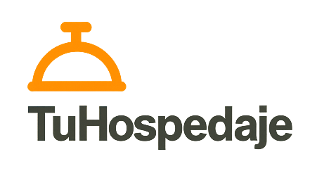
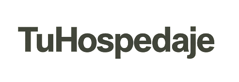
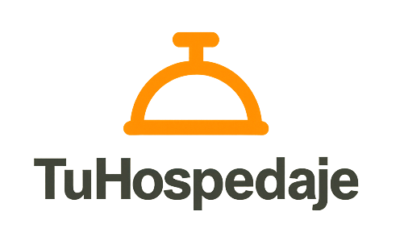

# 1. Propósito y autoridad

Este manual define la identidad de **TuHospedaje** y es la fuente principal para decisiones de marca. Aplica a producto digital, comunicaciones, documentos, redes y materiales impresos.

`DESIGN.md` traduce estas normas a criterios técnicos y registra su estado de implementación. No reemplaza este manual. El repositorio de producción determina qué está efectivamente implementado, sin convertir una excepción técnica en una regla de marca.

Este documento no define componentes, breakpoints, arquitectura frontend ni tokens de implementación. Esos detalles corresponden a `DESIGN.md`.

## 1.1. Personalidad

TuHospedaje acerca personas y alojamientos con una experiencia simple y confiable. La marca debe transmitir:

* **Cercanía:** comunicación humana, directa y respetuosa.
* **Pertenencia:** invitación a descubrir un lugar propio durante cada estadía.
* **Confianza:** información clara, verificable y sin promesas ambiguas.
* **Sencillez:** decisiones y recorridos fáciles de comprender.
* **Sensación de hogar:** calidez sin perder precisión ni profesionalismo.

Estas cualidades orientan el lenguaje y la imagen. Aún no existe una guía editorial exhaustiva para campañas, atención al cliente o comunicaciones de crisis; cualquier ampliación de voz debe aprobarse mediante el proceso de gobernanza de este manual.

\newpage

# 2. Sistema de logotipos

Existen cuatro variantes oficiales. Deben usarse desde los activos indicados, sin reconstruirlas ni separar sus partes.

## 2.1. Variantes y contextos

### Isologotipo: icono y texto horizontal

Variante principal para encabezados, pies, firmas institucionales y comunicaciones con ancho suficiente.

{ width=65% }

### Logotipo: texto

Para documentos o espacios horizontales donde la marca ya está contextualizada y el icono no es necesario.

{ width=48% }

### Isotipo: icono

Para favicon, avatar y espacios reducidos. Cuando el contexto no identifique claramente a TuHospedaje, debe acompañarse con un nombre accesible o visible.

{ width=24% }

### Imagotipo: icono y texto apilado

Para composiciones verticales, presentaciones y piezas con espacio central disponible.

{ width=36% }

## 2.2. Normas dimensionales

Las siguientes medidas son **normas incorporadas por la versión 2.0**; no describen una especificación histórica de los activos.

| Variante | Digital | Impreso |
|:---|---:|---:|
| Isologotipo | ancho mínimo `140 px` | ancho mínimo `35 mm` |
| Logotipo | ancho mínimo `120 px` | ancho mínimo `30 mm` |
| Isotipo | `24 x 24 px` mínimo | ancho mínimo `8 mm` |
| Imagotipo | ancho mínimo `96 px` | ancho mínimo `24 mm` |

Si el texto o la forma pierden definición, debe usarse un tamaño mayor aunque se cumpla el mínimo.

## 2.3. Espacio de seguridad y fondos

La unidad de seguridad **x** equivale a la altura de la letra mayúscula “T” del logotipo renderizado. Debe mantenerse al menos `1x` libre en los cuatro lados, sin texto, bordes, imágenes ni otros símbolos.

Fondos permitidos:

* Blanco o gris claro `#F4F4F9`, sin patrones.
* Fotografías sólo cuando exista un área uniforme y el logo conserve una separación visual clara.
* Otros colores únicamente después de verificar el contraste del activo completo en su tamaño final.

Los activos disponibles son policromáticos y transparentes. **No existe un activo monocromático oficial en `imagenes/`**; no debe simularse mediante filtros, recoloreado o CSS. Tampoco hay una versión inversa aprobada para fondos oscuros.

## 2.4. Checklist de uso

**Correcto**

* [ ] Elegir la variante según el espacio y el contexto.
* [ ] Mantener proporción, orientación, color y transparencia originales.
* [ ] Respetar tamaño mínimo y espacio de seguridad.
* [ ] Comprobar legibilidad sobre el fondo final.
* [ ] Usar el archivo oficial, no una captura ni una reconstrucción.

**Incorrecto**

* [ ] Estirar, comprimir, rotar o recortar el activo.
* [ ] Separar las partes de una variante o reordenarlas.
* [ ] Sustituir colores, aplicar filtros, sombras, biseles o contornos.
* [ ] Colocar el logo sobre fondos complejos o de bajo contraste.
* [ ] Crear una versión monocromática o inversa sin aprobar un activo nuevo.

\newpage

# 3. Paleta cromática

La paleta propia contiene cinco colores. Las muestras se generan localmente con LaTeX y no requieren recursos de red.

| Rol | Nombre perceptual | Hex | Muestra local | Uso principal |
|:---|:---|:---:|:---:|:---|
| Primario | Naranja | `#FF6B35` | \colorbox{brandorange}{\strut\hspace{1.2cm}} | Acción y énfasis de marca |
| Secundario | Azul petróleo / verde azulado oscuro | `#264653` | \colorbox{brandpetroleum}{\strut\hspace{1.2cm}} | Estructura, navegación y texto sobre fondos claros |
| Acento | Verde agua | `#2A9D8F` | \colorbox{brandwater}{\strut\hspace{1.2cm}} | Selección y énfasis secundario |
| Fondo | Gris claro | `#F4F4F9` | \colorbox{brandbackground}{\strut\hspace{1.2cm}} | Fondo principal claro |
| Texto | Gris oscuro | `#333333` | \colorbox{brandtext}{\strut\hspace{1.2cm}} | Texto principal |

`Paleta_de_colores_TuHospedaje.pdf` es un complemento cromático. Ante una diferencia normativa, prevalece este manual.

## 3.1. Contraste y combinaciones

Los ratios se calcularon con luminancia relativa sRGB según WCAG. Para texto normal se exige `4.5:1`; para texto grande (al menos `24 px` regular o `18.66 px` en negrita) y elementos gráficos esenciales, `3:1`.

| Frente / fondo | Ratio | Norma |
|:---|---:|:---|
| Azul petróleo `#264653` / gris claro `#F4F4F9` | `9.19:1` | Permitida para texto normal |
| Gris oscuro `#333333` / gris claro `#F4F4F9` | `11.52:1` | Permitida para texto normal |
| Naranja `#FF6B35` / gris oscuro `#333333` | `4.46:1` | Sólo texto grande o elemento gráfico; no texto normal AA |
| Naranja `#FF6B35` / azul petróleo `#264653` | `3.56:1` | Sólo texto grande o elemento gráfico |
| Azul petróleo `#264653` / verde agua `#2A9D8F` | `3.03:1` | Sólo texto grande o elemento gráfico |
| Verde agua `#2A9D8F` / gris oscuro `#333333` | `3.80:1` | Sólo texto grande o elemento gráfico |

Se prohíben para texto, información o controles esenciales las combinaciones restantes de la paleta: naranja/verde agua (`1.17:1`), azul petróleo/gris oscuro (`1.25:1`), naranja/gris claro (`2.59:1`) y verde agua/gris claro (`3.03:1` para texto normal). El color nunca debe ser la única señal de estado.

## 3.2. Marcas externas

Los colores oficiales de redes sociales y servicios externos pueden usarse en su icono o acción identificable. Son colores de la marca externa, no amplían la paleta propia de TuHospedaje ni deben reutilizarse como tokens del producto.

## 3.3. Modo oscuro

El modo oscuro es trabajo futuro. No hay una paleta oscura de marca definida, aprobada ni validada; esta versión no prescribe valores ni afirma que el producto ya la implemente.

\newpage

# 4. Tipografía

**Inter** es la tipografía oficial de marca y producto. Esta decisión reemplaza la especificación anterior basada en Segoe UI.

| Rol | Tamaño mínimo | Peso recomendado | Interlineado |
|:---|---:|---:|---:|
| Display | `40 px` | `700` | `1.10` |
| H1 | `32 px` | `700` | `1.20` |
| H2 | `24 px` | `600` | `1.25` |
| Body | `16 px` | `400` | `1.50` |
| Label | `14 px` | `500` | `1.40` |
| Caption | `12 px` | `400` | `1.40` |

Pesos autorizados para uso habitual: `400`, `500`, `600` y `700`. Deben preservarse jerarquías claras y evitarse textos de lectura continua por debajo de `16 px`.

La implementación web esperada debe cargar Inter explícitamente desde archivos administrados por el producto o una fuente aprobada, declarar `font-display: swap` u otra estrategia que evite texto invisible, limitar la precarga a archivos críticos y usar `system-ui`, `-apple-system`, `"Segoe UI"` y `sans-serif` como fallbacks. **La carga explícita aún no se afirma como implementada** y corresponde a un work unit posterior.

# 5. Fotografía

La fotografía debe mostrar alojamientos auténticos y ayudar a tomar una decisión informada.

* Mostrar espacios reales, habitables y representativos del alojamiento.
* Priorizar luz natural o iluminación interior creíble, color equilibrado y detalle visible.
* Incluir contexto útil: ambientes, accesos, vistas y servicios relevantes.
* Evitar sobreprocesado, saturación excesiva, perspectivas engañosas, elementos inexistentes y escenas que prometan una experiencia no verificable.
* Mantener coherencia entre portada, galería y descripción.

Las identidades canónicas y manifiestos de cada alojamiento conservan autoridad sobre su contenido visual específico. Este manual define la dirección común y no duplica esas reglas particulares.

# 6. Iconografía

Lucide es la dirección oficial del producto para iconos de interfaz.

* Usar iconos vectoriales, reconocibles y acompañados por etiqueta accesible cuando no haya texto visible.
* Mantener tamaños de `16`, `20` o `24 px` y trazo consistente dentro de una misma jerarquía.
* Alinear iconos con el texto y no mezclar estilos rellenos y lineales en el mismo nivel.
* No usar emoji como iconografía estructural, navegación o control.
* Permitir el color oficial de una marca externa sólo en la acción social correspondiente.

# 7. Voz y tono

La voz es cercana, clara, sencilla y confiable. Debe usar español neutral, verbos directos, información concreta y una acción siguiente cuando exista. No debe exagerar beneficios, culpabilizar a la persona ni ocultar condiciones.

| Contexto | Regla | Ejemplo |
|:---|:---|:---|
| CTA | Verbo y resultado esperado | “Reservar alojamiento” |
| Error | Explicar el problema y cómo continuar | “No pudimos cargar las fechas. Intenta nuevamente.” |
| Confirmación | Confirmar la acción y el estado | “Tu reserva quedó confirmada.” |
| Estado vacío | Describir el estado y ofrecer una salida | “No hay alojamientos para estas fechas. Prueba con otras.” |

No deben usarse mensajes vagos como “Algo salió mal” si se conoce el problema, ni urgencia artificial como “¡Última oportunidad!” sin evidencia verificable.

\newpage

# 8. Accesibilidad de marca

* Cumplir WCAG AA: `4.5:1` para texto normal y `3:1` para texto grande y elementos gráficos esenciales.
* No comunicar estado, selección, error o disponibilidad sólo mediante color.
* Mantener foco de teclado visible y distinguible en todos los controles.
* Adoptar `44 x 44 px` como área interactiva mínima del producto.
* Proveer texto alternativo útil para imágenes significativas. Para el logo enlazado a inicio, el nombre accesible recomendado es “TuHospedaje — Inicio”; una imagen decorativa debe tener alternativa vacía.
* No repetir “logo de” en el texto alternativo cuando el contexto ya identifica que es una imagen de marca.

Los atributos, tokens, estados y pruebas concretas pertenecen a `DESIGN.md` y a la implementación.

# 9. Gobernanza

| Campo | Valor |
|:---|:---|
| Versión | `2.0` |
| Fecha de aprobación documental | Agosto 2026 |
| Responsable de marca | Equipo de Desarrollo e Identidad |
| Responsable de implementación | Equipo de Desarrollo |
| Fuente principal | `docs/diseno/manual-identidad.md` |
| Publicación | `docs/diseno/manual-identidad-visual.pdf` |

## 9.1. Jerarquía de autoridad

1. Este manual define la identidad de marca.
2. Los activos oficiales materializan logos e imágenes aprobadas.
3. `DESIGN.md` traduce las normas a decisiones técnicas y registra adopción o deuda.
4. El código de producción prueba qué está implementado, pero no redefine la marca por sí solo.

## 9.2. Proceso de cambio

Toda modificación debe indicar motivo, alcance, responsable, activos afectados y estado de implementación. Un cambio normativo requiere revisión de marca; un cambio técnico subordinado se registra en `DESIGN.md`. Cuando cambie este archivo, debe regenerarse `manual-identidad-visual.pdf` y verificarse la coherencia de ambos.

**Checklist de aprobación**

* [ ] La propuesta respeta personalidad, accesibilidad y jerarquía de autoridad.
* [ ] No presenta trabajo futuro como implementado.
* [ ] Los activos citados existen y sus rutas son válidas.
* [ ] Los colores nuevos tienen rol y contraste calculado.
* [ ] La implementación pendiente está registrada en `DESIGN.md`.
* [ ] Markdown y PDF contienen la misma versión normativa.

# 10. Recursos y límites

| Recurso | Ruta relativa |
|:---|:---|
| Isologotipo | `imagenes/TuHospedaje_Isologotipo.png` |
| Logotipo | `imagenes/TuHospedaje_Logotipo.png` |
| Isotipo | `imagenes/TuHospedaje_Isotipo.png` |
| Imagotipo | `imagenes/TuHospedaje_Imagotipo.png` |
| Complemento cromático | `Paleta_de_colores_TuHospedaje.pdf` |

Este manual no cubre componentes, breakpoints, arquitectura frontend, estructura de páginas ni detalle de estados interactivos. Consultar `DESIGN.md` para esa traducción técnica y su estado de implementación.
